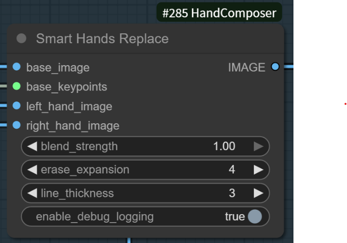
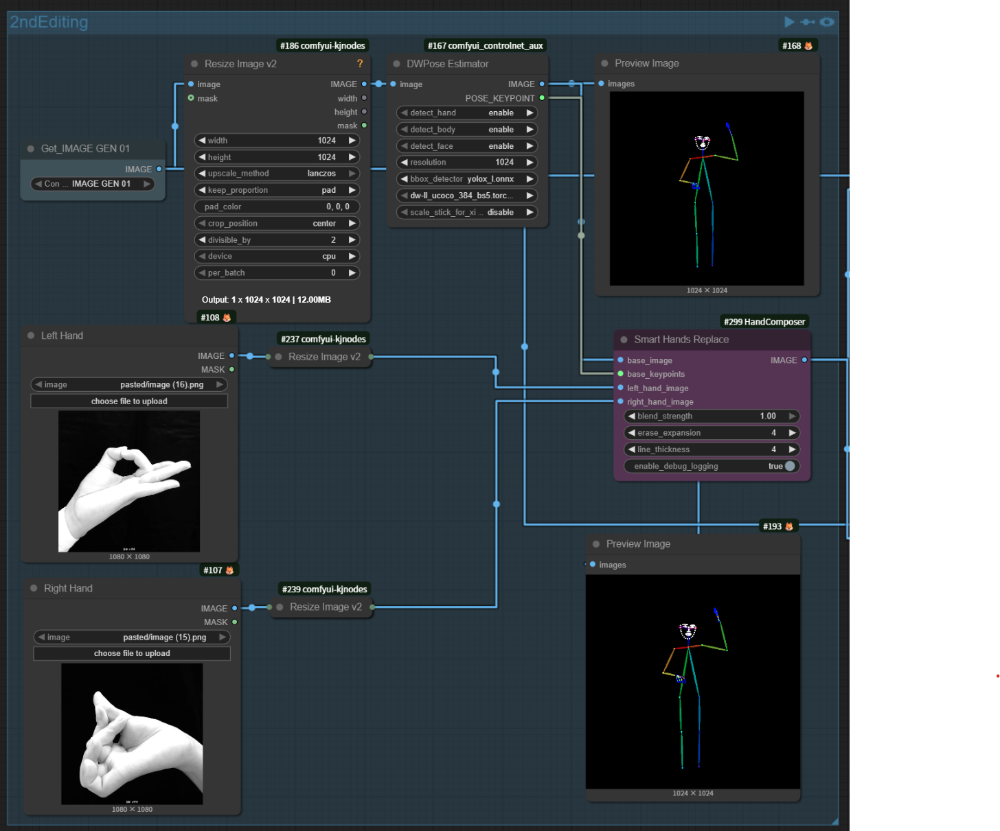
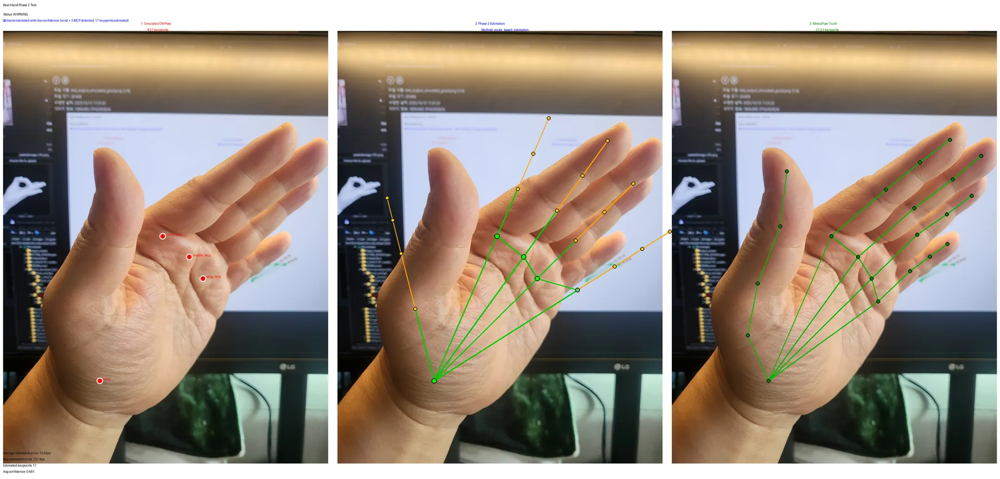

# Smart Hands Replace

**Smart Hand Pose Replacement for ComfyUI**

Replace hand poses in images using DWPose skeletons with automatic keypoint detection and intelligent transformation.

## Features

- **Automatic Hand Detection**: 3-stage detection pipeline (MediaPipe � Phase2 Estimation � Basepose fallback)
- **Intelligent Flip Detection**: Arm direction-based flip logic using elbow�wrist vector analysis
- **Resolution-Independent Transforms**: Normalized coordinate space (0.0-1.0) for multi-resolution workflows
- **Distance-Based Hand Sizing**: Accurate hand size calculation using wrist�MCP distance
- **DWPose Skeleton Output**: Colored bone connections with blue keypoint circles for VLM integration
- **Full-Body Support**: Automatic detection and adjustment for full-body vs hand-only skeletons

## Installation

1. Clone to custom_nodes directory:
```bash
cd ComfyUI/custom_nodes
git clone https://github.com/nnkann/SmartHandsComposer.git
```

2. Restart ComfyUI

**Note:** Dependencies (mediapipe, opencv-python, scipy) will be automatically installed by ComfyUI Manager when needed.

## Usage

### Basic Workflow

```
DWPose Estimator � base_keypoints
    �
Load Image � base_image
    �
Hand Images � left_hand_image / right_hand_image
    �
SmartHandsReplace Node
    �
Output: Image with replaced hand skeletons
```

**Example Workflows:**
- [image_qwen_controlnet_custom_v2.json](assets/image_qwen_controlnet_custom_v2.json) - Complete workflow with Qwen VL integration, DWPose, and hand replacement

### Node: SmartHandsReplace



**Inputs:**
- `base_image`: Original image or photo (not skeleton visualization)
- `base_keypoints`: DWPose POSE_KEYPOINT format
- `left_hand_image`: Left hand reference image
- `right_hand_image`: Right hand reference image
- `blend_strength`: Blend factor (default: 1.0)
- `erase_expansion`: Erase mask expansion in pixels (default: 4)
- `line_thickness`: Skeleton line thickness (default: 4)
- `enable_debug_logging`: Enable detailed logging (default: False)

**Output:**
- Skeleton image with transformed hand poses (colored lines + blue keypoint circles)

**Important: Image Resolution Matching**

All input images (`base_image`, `left_hand_image`, `right_hand_image`) must have matching canvas dimensions for proper keypoint alignment.

**Recommended workflow:**
1. Use a **Resize Image** node to normalize all images to **1024px** (width or height)
2. Connect resized images to SmartHandsReplace inputs
3. This ensures consistent coordinate space for hand detection and transformation

Example workflow:
```
Load Image → Resize (1024px) → base_image
Hand Image Left → Resize (1024px) → left_hand_image
Hand Image Right → Resize (1024px) → right_hand_image
```



*Complete workflow showing Resize Image nodes normalizing all inputs to 1024px before connecting to SmartHandsReplace*

### Integration with Qwen VL Models

The skeleton output is optimized for Vision-Language Models like Qwen-VL:

```
SmartHandsReplace � skeleton image
    �
Qwen Text Encoder
  image1: Original photo
  image2: Skeleton image (from SmartHandsReplace)
  prompt: "Replace the hands in image1 with the hand pose from image2. Each finger joint must align with the blue keypoints."
    �
Generate with Qwen
```

**Recommended Prompts:**

**Positive:**
```
Replace the hands in image1 with new hands that exactly match the hand pose shown by the blue skeleton keypoints in image2. Each finger joint must precisely align with the blue circular markers. Maintain the natural skin tone, lighting, and photorealistic quality of the original hands.
```

**Negative:**
```
blurry hands, deformed fingers, extra fingers, missing fingers, fused fingers, mutated hands, poorly drawn hands, bad anatomy, wrong proportions, disconnected wrist, floating hands, skeleton visible in final image, blue circles in final image, colored lines in final image, low quality, artifacts
```

### Node: ComposeMultipleImages

Utility node for creating grid layouts of hand reference images.

**Inputs:**
- `images`: Batch of images to compose
- `cell_size`: Size of each cell (default: 256)
- `padding`: Spacing between cells (default: 10)
- `background_color`: Background color (black/white/gray)
- `auto_canvas_size`: Auto-calculate canvas size

## Technical Details

### Hand Detection Pipeline

1. **MediaPipe (Primary)**: Hand-only detection with 0.35 confidence threshold
2. **Phase 2 Estimation**: Uses wrist + MCP anchors from base pose
3. **Basepose Fallback**: Direct use of base pose keypoints



*3-stage detection pipeline: MediaPipe keypoints (left) → Phase2 bone estimation (center) → Full skeleton integration (right)*

### Transform Pipeline

```
Canvas Coordinates � Relative (0.0-1.0) � Flip � Rotate � Scale � Image Coordinates
```

**Flip Detection:**
- Compares arm direction (elbow�wrist) with hand direction (wrist�MCP)
- Flips if vectors point in opposite horizontal directions
- Angle adjustment: � � (180� - �) when flipped

**Hand Size Calculation:**
- Distance-based method: (wrist�MCP distance � 6)�
- 1.2x multiplier applied for visual accuracy
- Handles full-body vs hand-only skeletons automatically

### Coordinate Systems

- **Canvas Space**: DWPose coordinate system (may differ from image resolution)
- **Relative Space**: Normalized 0.0-1.0 coordinates (resolution-independent)
- **Image Space**: Actual pixel coordinates for drawing

## Parameters

### Hand Size Multiplier

```python
HAND_SIZE_MULTIPLIER = 1.2  # Adjust in nodes.py for larger/smaller hands
```

- `1.0` = exact base pose size
- `>1.0` = larger hands
- `<1.0` = smaller hands

### Detection Thresholds

```python
FULLBODY_DETECTION_THRESHOLD = 3.0  # bbox ratio threshold for full-body detection
BASELINE_HAND_COVERAGE = 0.1        # keypoint bbox covers 10% of actual hand
```

## Troubleshooting

### Issue: Hands are too large/small
**Solution:** Adjust `HAND_SIZE_MULTIPLIER` constant in [nodes.py:53](nodes.py#L53)

### Issue: Hands are flipped incorrectly
**Solution:** Enable `enable_debug_logging` to check arm/hand direction vectors

### Issue: MediaPipe detection fails
**Solution:**
- Ensure hand is clearly visible in image
- Check MediaPipe installation: `pip install mediapipe`
- Will automatically fall back to Phase 2 or Basepose

### Issue: Blue skeleton artifacts in Qwen output
**Solution:**
- Verify base_image input is original photo (not skeleton visualization)
- Check workflow connections - skeleton should only be in SmartHandsReplace output

## Performance

### Hardware Recommendations

- **Minimum**: 8GB RAM, any GPU with 4GB VRAM
- **Recommended**: 16GB RAM, GPU with 8GB+ VRAM for Qwen integration
- **Optimal**: 32GB RAM, RTX 3080+ (12GB VRAM) for GGUF Q5_0 models

### Processing Time

- **Hand Detection**: 50-200ms per hand (MediaPipe)
- **Transform + Drawing**: 10-50ms per hand
- **Total**: ~100-500ms for dual hand composition

## Dependencies

- **Required:**
  - torch
  - numpy
  - PIL (Pillow)
  - opencv-python
  - scipy

- **Optional but Recommended:**
  - mediapipe (for best hand detection accuracy)

## License

MIT License - See LICENSE file for details

## Credits

- DWPose format specification
- MediaPipe hand landmark detection by Google
- ComfyUI framework

## Contributing

Issues and pull requests welcome! Please include:
- ComfyUI version
- Python version
- Error logs with `enable_debug_logging=True`
- Sample workflow JSON

## Changelog

See [CHANGELOG.md](CHANGELOG.md) for version history and development notes.
